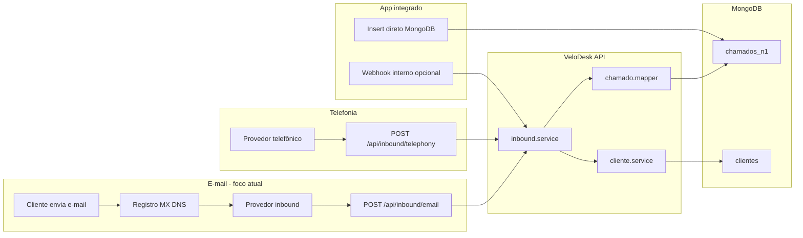
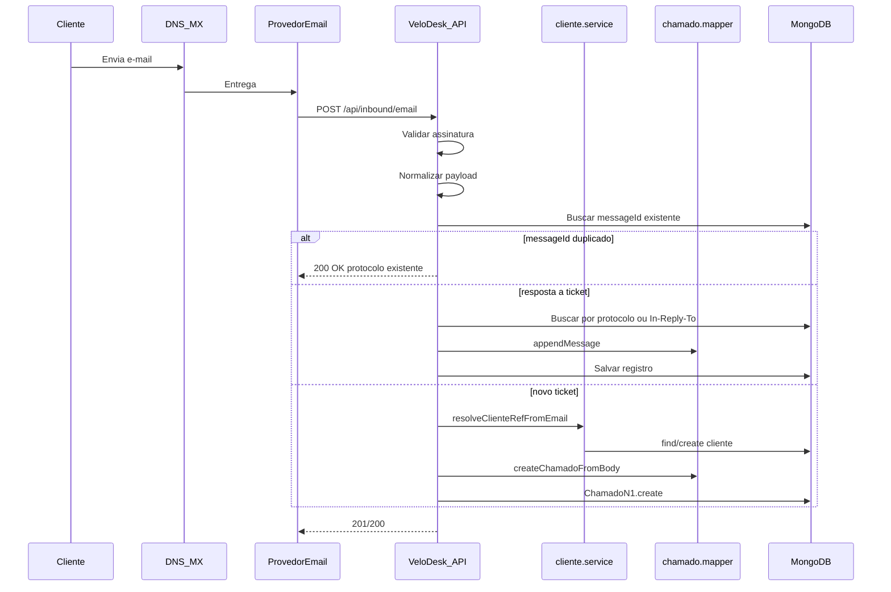

# Plano: Entrada de tickets no VeloDesk (foco e-mail)

**Versão:** v1.1.0  
**Origem:** cópia do plano Cursor (`entrada_tickets_velodesk_47032842.plan.md`)  
**Status:** Fase 1 implementada (inbound e-mail)

## Tarefas

- [x] Estender `cliente.service.ts`: `normalizeEmail`, `findClienteByEmail`, `resolveClienteRefFromEmail`
- [x] Criar `email-inbound.service.ts`: normalização, idempotência, novo ticket vs resposta, metadados em `alteracoes`
- [x] Criar `inbound.routes.ts` + `inboundAuth.ts` + adapters de provedor (generic + Mailgun)
- [x] Adicionar vars `INBOUND_EMAIL_*` em `env.ts` / `.env.example` e montar rotas multipart no `index.ts`
- [x] Documentar configuração DNS MX/webhook e deploy Cloud Run no README
- [x] Esboçar `email-outbound.service.ts` para confirmação de protocolo (Fase 1b)
- [ ] Implementar envio outbound real (Fase 1b)
- [x] Stub `POST /api/inbound/telephony` (Fase 2 — retorna 501)
- [ ] Implementar telefonia completa (Fase 2)

---

## Contexto atual

Hoje o VeloDesk só persiste tickets via `POST /api/tickets` com **JWT de agente**. Não há webhooks, inbound mail nem integração telefônica. O fluxo manual usa CPF → `GET /api/clients?cpf=` → draft → `createChamadoFromBody`.

Campos relevantes já existentes (sem mudança de schema):

- Ticket: [`backend/src/models/ChamadoN1.ts`](../backend/src/models/ChamadoN1.ts) — `chamadoProtocolo`, `cliente[]`, `tabulacao[]`, `registro[]`
- Cliente: [`backend/src/models/Cliente.ts`](../backend/src/models/Cliente.ts) — `clienteDados[].clienteEmail.lista[]`
- Criação: [`backend/src/services/chamado.mapper.ts`](../backend/src/services/chamado.mapper.ts) — `createChamadoFromBody`, `appendMessage`, `generateProtocolo()`
- Lookup: [`backend/src/services/cliente.service.ts`](../backend/src/services/cliente.service.ts) — só CPF/`_id` hoje

**Premissas** (perguntas não respondidas — ajustáveis na implementação):

- Provedor de e-mail **agnóstico** (adapter Mailgun / SendGrid / SES)
- Remetente desconhecido → **criar cliente provisório** (nome + e-mail, CPF vazio) e abrir ticket
- Deploy do webhook no **Cloud Run** (`velodesk-api`), não no Vercel

---

## Visão dos 3 canais



| Canal | Complexidade | Fase | Abordagem |
|-------|-------------|------|-----------|
| App integrado | Baixa | 2 | Insert direto em `chamados_n1`; webhook interno opcional para notificar desk |
| Telefonia | Média | 2 | Novo endpoint webhook + adapter do JSON do provedor |
| **E-mail** | **Alta (crítico)** | **1** | MX → provedor → webhook → ticket |

---

## Fase 1 — E-mail inbound (implementação principal)

### 1. Infraestrutura DNS e provedor

Configuração **fora do código**, documentada no README/deploy:

1. Escolher subdomínio inbound (ex.: `chamados.seudominio.com.br`)
2. No provedor: criar domínio/route inbound
3. **DNS MX** do subdomínio apontando para o provedor (ex.: Mailgun `mxa.mailgun.org`)
4. Configurar **route/action** do provedor → `POST https://<url-cloud-run>/api/inbound/email`
5. SPF/DKIM do subdomínio (necessário também para **saída** futura)
6. Variáveis no Cloud Run / `.env`:

```env
INBOUND_EMAIL_ENABLED=true
INBOUND_EMAIL_PROVIDER=mailgun|sendgrid|ses|generic
INBOUND_EMAIL_WEBHOOK_SECRET=...
INBOUND_EMAIL_ALLOWED_RECIPIENTS=chamados@seudominio.com.br
```

**Importante:** o endpoint precisa aceitar `multipart/form-data` (Mailgun/SendGrid enviam assim) além de JSON — ajustar parser no Express antes do handler.

### 2. Novo endpoint (aditivo, sem JWT)

Arquivo sugerido: [`backend/src/routes/inbound.routes.ts`](../backend/src/routes/inbound.routes.ts)

| Rota | Auth | Função |
|------|------|--------|
| `POST /api/inbound/email` | Assinatura do provedor | Receber e-mail parseado |
| `GET /api/inbound/email/health` | Nenhuma | Health check para validação do provedor |

Montagem em [`backend/src/index.ts`](../backend/src/index.ts):

- Registrar rota **fora** do rate limit genérico de `/api/` ou com limite dedicado
- Usar `express.raw()` / `multer` apenas nesta rota para preservar body na verificação de assinatura

Middleware: [`backend/src/middleware/inboundAuth.ts`](../backend/src/middleware/inboundAuth.ts)

- Validar HMAC/assinatura conforme `INBOUND_EMAIL_PROVIDER`
- Rejeitar `401` se assinatura inválida

### 3. Serviço de processamento de e-mail

Arquivo: [`backend/src/services/email-inbound.service.ts`](../backend/src/services/email-inbound.service.ts)

**Pipeline:**

```
Webhook payload → normalizar campos → idempotência → resolver cliente → novo ticket OU resposta → persistir
```

**Normalização** (adapter por provedor → formato interno):

```typescript
interface InboundEmailPayload {
  messageId: string;      // Message-Id
  inReplyTo?: string;     // In-Reply-To
  references?: string[];  // References
  from: { email: string; name?: string };
  to: string[];
  subject: string;
  textBody: string;
  htmlBody?: string;
  attachments?: { filename: string; contentType: string; urlOrBuffer: ... }[];
  receivedAt: Date;
}
```

**Idempotência** (sem alterar schema):

- Consultar tickets cujo `registro.alteracoes.emailMessageId === messageId`
- Se já processado → retornar `200` com protocolo existente (evita duplicata em retry do provedor)

**Detecção novo ticket vs. resposta:**

1. **Resposta a ticket existente** se:
   - Assunto contém protocolo `VD-YYYYMMDD-####` (regex já usada em `generateProtocolo`), **ou**
   - Header `In-Reply-To` / `References` bate com `emailMessageId` salvo em algum registro
2. **Novo ticket** caso contrário

**Novo ticket** — montar body compatível com mapper existente:

```typescript
{
  title: subject || 'Atendimento por e-mail',
  chamadoTitulo: subject,
  description: textBody,
  status: 'novo',
  clientName: from.name || from.email.split('@')[0],
  lateralForm: {
    clienteEmail: [from.email],
    canal: 'E-mail',
    classificacaoTipo: 'Solicitação',
    motivo: subject,
    detalhe: textBody.slice(0, 500),
  }
}
```

Primeiro `registro.alteracoes` recebe metadados:

```typescript
{
  source: 'email-inbound',
  emailMessageId, emailFrom, emailSubject,
  emailInReplyTo, emailReferences
}
```

**Resposta a ticket existente** — reutilizar `appendMessage()` de [`chamado.mapper.ts`](../backend/src/services/chamado.mapper.ts):

- `text` = corpo do e-mail (preferir `text/plain`; fallback strip HTML)
- `sender: 'them'`
- `internal: false`
- Metadados de e-mail em `alteracoes` do novo registro

### 4. Lookup de cliente por e-mail

Estender [`backend/src/services/cliente.service.ts`](../backend/src/services/cliente.service.ts):

```typescript
normalizeEmail(value) → lowercase + trim

findClienteByEmail(emailRaw) →
  Cliente.findOne({
    'clienteDados.clienteEmail.lista': normalizeEmail(emailRaw)
  })
  // query case-insensitive via normalização na gravação
```

Nova função `resolveClienteRefFromEmail(from, displayName?)`:

1. `findClienteByEmail(from)` → se achar, retorna `{ clienteCpf, clienteId }`
2. Se não achar → `upsertClienteFromBody` com nome + e-mail (CPF vazio) — **já suportado** por `dadosFromBody` quando há `nome`
3. Se múltiplos clientes com mesmo e-mail (edge case do array) → pegar o mais recente e registrar warning em log

Opcional (performance, sem mudar schema): índice MongoDB em `clienteDados.clienteEmail.lista` — **solicitar autorização** antes de criar.

### 5. Anexos

Fase 1 mínima:

- Salvar URLs temporárias do provedor em `anexosMensagemPublica[]` (já suportado pelo mapper)
- Fase 1.1: integrar [`backend/src/routes/uploads.routes.ts`](../backend/src/routes/uploads.routes.ts) quando `GCP_STORAGE_BUCKET` estiver ativo — download do anexo → GCS → URL permanente

### 6. Saída por e-mail (escopo paralelo, não bloqueia inbound)

Inbound e outbound são complementares. Para esta fase, **registrar no plano** mas implementar em sub-fase:

- [`backend/src/services/email-outbound.service.ts`](../backend/src/services/email-outbound.service.ts) — envio via API do provedor
- Gatilhos: criação de ticket (protocolo), resposta do agente (`POST /api/tickets/:id/messages`)
- Template: assunto `[VD-YYYYMMDD-####] {titulo}` para permitir threading
- Variáveis: `EMAIL_FROM`, `EMAIL_API_KEY`

Sem outbound, tickets abertos por telefonia/app ainda precisarão de e-mail — isso fica como **Fase 1b**.

### 7. Arquivos a criar/alterar (Fase 1)

| Arquivo | Ação |
|---------|------|
| `backend/src/routes/inbound.routes.ts` | **Criar** — rotas webhook |
| `backend/src/services/email-inbound.service.ts` | **Criar** — pipeline e-mail |
| `backend/src/services/inbound-email/adapters/*.ts` | **Criar** — Mailgun, SendGrid, generic |
| `backend/src/middleware/inboundAuth.ts` | **Criar** — validação assinatura |
| `backend/src/services/cliente.service.ts` | **Alterar** — `findClienteByEmail`, `resolveClienteRefFromEmail` |
| `backend/src/config/env.ts` | **Alterar** — vars inbound |
| `backend/.env.example` | **Alterar** — documentar vars |
| `backend/src/index.ts` | **Alterar** — montar rotas + parser multipart |
| `README.md` | **Alterar** — seção DNS/webhook |

**Não alterar:** schemas `ChamadoN1`, `Cliente`, contratos de `POST /api/tickets` existente.

---

## Fase 2 — Telefonia (webhook)

Endpoint: `POST /api/inbound/telephony`

- Auth: API key ou HMAC (`INBOUND_TELEPHONY_WEBHOOK_SECRET`)
- Adapter do JSON do provedor → mesmo pipeline interno de criação
- Lookup de cliente: telefone (`clienteTelefone.lista`) — espelhar lógica do e-mail
- Metadados em `registro.alteracoes`: `{ source: 'telephony', externalCallId }`
- Idempotência por `externalCallId`

Reutilizar funções extraídas da Fase 1: `inbound-ticket.service.ts` genérico chamado por e-mail e telefonia.

---

## Fase 3 — App integrado

Como o app é interno:

1. **Insert direto** em `b2c_chamados.chamados_n1` seguindo estrutura de [`ChamadoN1`](../backend/src/models/ChamadoN1.ts)
2. **Opcional:** `POST /api/inbound/internal` com service token para:
   - Validar payload
   - Disparar evento interno (SSE/WebSocket futuro, ou refresh do kanban)
   - Garantir protocolo único e join de cliente

Sem necessidade de DNS; documentar contrato mínimo do documento MongoDB para o time do app.

---

## Fluxo detalhado — e-mail (Fase 1)



---

## Riscos e mitigações

| Risco | Mitigação |
|-------|-----------|
| Spam / e-mail malicioso | Assinatura webhook + allowlist de destinatários + rate limit dedicado |
| Duplicata em retry do provedor | Idempotência por `Message-Id` em `alteracoes` |
| Cliente sem CPF | Cliente provisório com e-mail; agente completa cadastro no desk |
| HTML-only sem texto | Strip HTML server-side (lib leve, ex. `html-to-text`) |
| Anexos grandes | Limite de tamanho no provedor + limite Express |
| Canal não persiste no Mongo | Metadado `source: 'email-inbound'` em `alteracoes`; DTO pode derivar `channel: 'email'` no mapper (melhoria futura, sem schema) |
| Cloud Run cold start | Health check + timeout adequado no provedor |

---

## Ordem de implementação recomendada

1. `findClienteByEmail` + `resolveClienteRefFromEmail` em `cliente.service.ts`
2. `email-inbound.service.ts` com adapter `generic` (JSON manual para testes locais)
3. `inbound.routes.ts` + middleware de auth + montagem no `index.ts`
4. Teste local com curl simulando webhook
5. Adapter do provedor escolhido + config DNS em staging
6. (Paralelo) esboço `email-outbound.service.ts` para confirmação de protocolo
7. Fase 2 telefonia reutilizando pipeline inbound genérico

---

## Test plan (Fase 1)

- [ ] E-mail de remetente **cadastrado** → ticket novo com cliente vinculado por e-mail
- [ ] E-mail de remetente **desconhecido** → cliente provisório + ticket novo
- [ ] Resposta com protocolo no assunto → mensagem anexada ao ticket correto
- [ ] Resposta com `In-Reply-To` → mensagem anexada sem protocolo no assunto
- [ ] Reenvio do mesmo `Message-Id` → idempotente, sem ticket duplicado
- [ ] Assinatura inválida → `401`
- [ ] Ticket aparece no kanban (`GET /api/boxes`) com status `novo`
